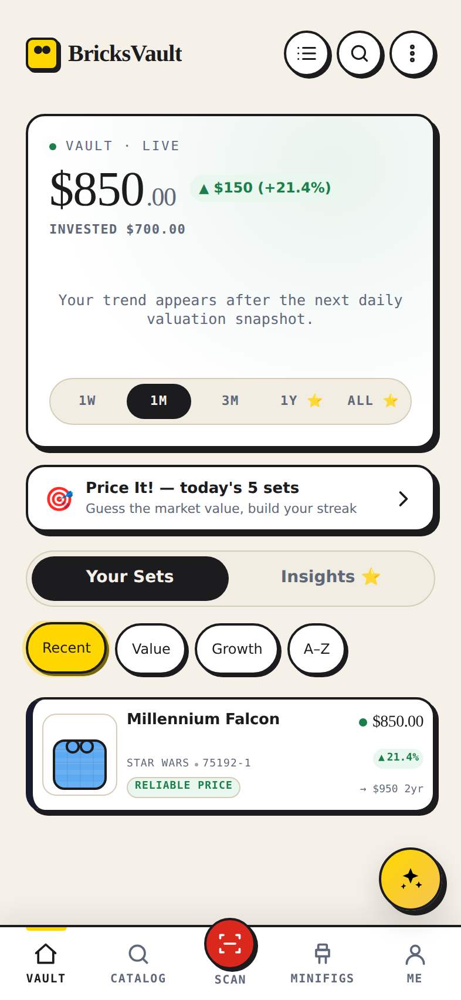

<div align="center">


# BricksVault

**A mobile-first PWA and native Android app that treat a LEGO collection like an investment portfolio.**

Log the sets you own, see live market value and ROI, get AI price forecasts,
scan barcodes to identify sets, and track a wishlist with price-drop alerts.

[**bricksvault.app**](https://bricksvault.app)

[](https://github.com/yarik1390/MyBricks/actions/workflows/deploy-worker.yml)
[](https://github.com/yarik1390/MyBricks/actions/workflows/e2e-smoke.yml)
[](https://github.com/yarik1390/MyBricks/actions/workflows/a11y.yml)



</div>

---

## What it is

Most collection trackers are inventory lists. BricksVault is a **valuation
engine** with a collection tracker attached: every set carries a blended market
value assembled from several independent price sources, a confidence grade, and
a plain-English explanation of where the number came from.

Sign-in is optional — guests get the full app with local-only data (IndexedDB +
localStorage) and never touch the API. Signing in with Supabase syncs a real
account across devices.

**Scale:** ~27,000 sets and ~17,000 minifigs in D1, kept fresh by 34 cron triggers.

## Features

**Portfolio** · value + ROI with sparkline history · per-set price trends ·
storage locations, conditions, quantities · CSV import/export · Google Sheets
sync · weekly digest email · public profile with a Trophy Shelf

**Discovery** · full Rebrickable catalog with FTS search, theme/year/retired
filters · camera barcode scanner · AI photo identification · deal signals ·
retirement-risk radar · "what can I build" from owned parts · minifig tracker

**Pricing** · blended valuations from BrickLink, BrickEconomy, eBay (ask +
sold), PriceCharting, BrickOwl and community comps · AI 2y/5y forecasts ·
wishlist price-drop alerts (push + email) · per-source confidence and freshness
grading

**Platform** · installable PWA with offline support and a mutation outbox ·
native Android app via Capacitor ([details](#android)) · 9 languages (en, de,
es, fr, hi, ja, nl, uk, zh) · light/dark themes · kids mode · portfolio-aware
AI advisor chat

## Stack

| Layer | Choice |
|---|---|
| API | Cloudflare **Workers** — TypeScript, [Hono](https://hono.dev) |
| Database | Cloudflare **D1** (SQLite) + **KV** cache + **R2** photos |
| Analytics | Cloudflare **Analytics Engine** |
| Auth | **Supabase** JWT (HS256), verified in the Worker |
| Frontend | **Vanilla JS** SPA — ES modules, hash routing, `morphdom` diffing, no framework |
| Hosting | Cloudflare **Pages** (static) + Workers (API) |
| AI | Gemini + OpenAI, server keys or user BYOK, via Cloudflare AI Gateway |
| Mobile | **Capacitor** (Android), RevenueCat billing |
| CI/CD | GitHub Actions — auto-deploy on push |

The frontend is deliberately framework-free: template-literal HTML mounted with
`morphdom`, event delegation, and a hand-rolled router. It ships as plain ES
modules with no build step.

## Repository map

```
public/           # the SPA — served by Cloudflare Pages
  js/views/       # one module per page (portfolio, catalog, minifigs, me, …)
  js/components/  # advisor drawer, scanner, sheets, onboarding
  js/locales/     # 9 languages × 2 dictionary layers
  sw.js           # versioned service worker (bump VERSION on asset changes)
worker/           # the API
  src/routes/     # one Hono sub-app per resource (24 mounted groups)
  src/jobs/       # 35 cron handlers — valuations, scrapes, imports, snapshots
  src/lib/        # external integrations + pure helpers
  schema.sql      # authoritative D1 schema
  wrangler.toml   # bindings, vars, cron triggers
android/          # Capacitor shell
e2e/ a11y/ load/  # Playwright e2e, axe accessibility, k6 load tests
```

## Development

```bash
# Worker (API)
cd worker
npm ci
npm run typecheck        # tsc --noEmit
npx vitest run           # 693 tests, 60 files (runs in workerd)
npx wrangler dev         # needs .dev.vars — see .dev.vars.example

# Frontend (from repo root)
npm ci
npm test                 # UI-string catalog + i18n checks + 263 unit tests
npx biome lint
npx playwright test --config=e2e/playwright.config.mjs
```

Every push runs five gates in CI — root tests, Biome, a strict `checkJs` pass
over the shared pure helpers, Worker typecheck, and Worker vitest. Run all five
locally before pushing; each has caught a deploy that the others let through.

## Android

The same `public/` bundle ships as a native Android app through **Capacitor** —
the shell and all guest features work offline from first launch, with no network
round-trip needed to open the app.

| | |
|---|---|
| App id | `app.bricksvault` (matches `capacitor.config.json`, `build.gradle`, `assetlinks.json`) |
| Current | `1.0.55` (versionCode = commit count, floored at 56 — auto-derived, never hand-bumped) |
| SDK | min 24, compile/target 36 |
| Native plugins | MLKit barcode scanning, biometric unlock, push (FCM), filesystem, share, haptics, network |
| Billing | RevenueCat — entitlements arrive via the webhook, not the client |

Building is a workflow dispatch, not a push:
[`build-android.yml`](.github/workflows/build-android.yml) runs on a plain
Ubuntu runner (no Android Studio), builds `bundle` or `apk-debug`, signs with
the upload keystore from repo secrets, and force-pushes the signed `.aab` plus
its ProGuard mapping to the **`aab-delivery`** branch. That branch is a release
artifact channel, not stale work — don't delete it.

Deep links are wired at deploy time: the "Configure Android App Links" step runs
[`scripts/configure-assetlinks.mjs`](scripts/configure-assetlinks.mjs) so
`assetlinks.json` on the live origin carries the signing certificate
fingerprint. Before cutting a release, `npm run android:preflight` checks the
app id, version, and store metadata line up.

```bash
npx cap sync android      # required after ANY public/ asset change
npm run android:preflight
```

## Deploying

Pushing to the default branch triggers
[`deploy-worker.yml`](.github/workflows/deploy-worker.yml), which applies the D1
schema and migrations, uploads secrets, deploys the Worker, then deploys Pages
with the Worker URL injected into `env.js`.

Two constraints that have broken deploys before, both documented in
[`CLAUDE.md`](./CLAUDE.md):

- **D1 rejects `ALTER TABLE ... ADD COLUMN IF NOT EXISTS`.** New columns go in
  *both* `worker/schema.sql` and `worker/schema_migrate.sql`.
- **Cron strings need day names, not `0` for Sunday.** `0 4 * * SUN`, never
  `0 4 * * 0`.

## Documentation

| Doc | Contents |
|---|---|
| [`AGENTS.md`](./AGENTS.md) | Full engineering handoff — architecture, data model, API surface, deploy pipeline, gotchas, changelog |
| [`CLAUDE.md`](./CLAUDE.md) | Quick-start conventions for AI agents working in the repo |
| [`PRICING-AUDIT.md`](./PRICING-AUDIT.md) | How the valuation blend works and why |
| [`HANDOFF-sources.md`](./HANDOFF-sources.md) | Per-source pricing integration notes |

## License

No license — **all rights reserved**. The source is public to read, but not
licensed for reuse, redistribution, or derivative works.
